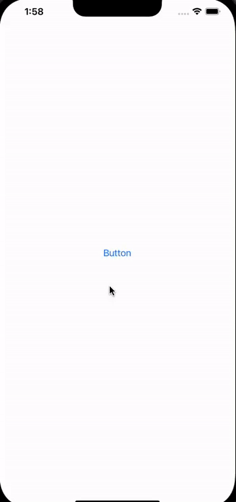

# YCDateFilter

[](https://travis-ci.org/杨超/YCDateFilter)
[](https://cocoapods.org/pods/YCDateFilter)
[](https://cocoapods.org/pods/YCDateFilter)
[](https://cocoapods.org/pods/YCDateFilter)


- [中文](../README.md)
- English


## description
This component is used to select a month or date range

## Support
iPhone / iPad


## Installation

YCDateFilter is available through [CocoaPods](https://cocoapods.org). To install
it, simply add the following line to your Podfile:


```ruby
pod 'YCDateFilter'
```

## Usage

```
@interface YCViewController ()

@property (nonatomic, strong) YCDateFilterViewController *filterVc;

@end
```

```
self.filterVc.modalPresentationStyle = UIModalPresentationOverFullScreen;
// 选择器回调
self.filterVc.dateRangeBlock = ^(NSString *startTime, NSString *endTime, NSString *showString) {
    
};
[self presentViewController:self.filterVc animated:YES completion:nil];
    
```



## Author

杨超, 1552612373@qq.com

## License

YCDateFilter is available under the MIT license. See the LICENSE file for more info.
